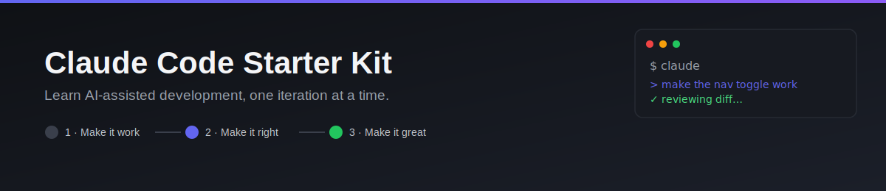
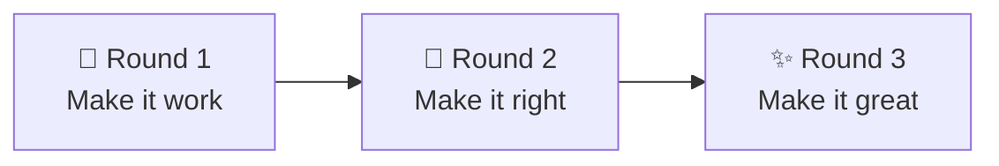

<p align="center">
  
</p>

<p align="center">
  
  
  
  
</p>

A small, **intentionally-unfinished** product landing page, built for anyone learning
to use the [Claude Code](https://docs.claude.com/en/docs/claude-code) CLI hands-on.

No build tools, no dependencies — just `index.html`, `styles.css`, and `script.js`.
Clone it, open `index.html` in a browser, and start prompting.

> There are no "after" screenshots in this README on purpose — finishing the page
> *is* the exercise. Open `index.html` yourself to see the starting point.

## Contents

- [Getting started](#getting-started)
- [The 3-iteration workflow](#the-3-iteration-workflow-the-actual-point-of-this-repo)
- [Hands-on practice tasks](#hands-on-practice-tasks)
- [Tips for working with Claude Code](#tips-for-working-with-claude-code)

## Getting started

```bash
git clone https://github.com/prahalad007/claude-code-starter-kit.git
cd claude-code-starter-kit
claude
```

Once Claude Code is running in this folder, just describe what you want in plain
English — it reads the files, proposes edits, and shows you the diff before anything
is saved.

## The 3-iteration workflow (the actual point of this repo)

The most common mistake people make with AI coding tools: type one giant request —
*"build me a finished landing page"* — get back a wall of changes they don't fully
understand, and either accept it blindly or give up. Then they conclude "AI isn't
good enough for real work," when the real problem was the process, not the model.

The fix is the same one working engineers already use, applied to prompting:



| Round | Goal | What "done" looks like |
|---|---|---|
| 🧱 1 — Make it work | Functionally correct, however rough | One small, reviewable diff — no edge cases, no styling |
| 🔧 2 — Make it right | Handle edge cases, validate input | Shortcuts from round 1 removed, another small diff |
| ✨ 3 — Make it great | Polish | UX, responsiveness, accessibility — final diff |

Each round produces something you can actually verify before moving to the next —
instead of one enormous change you have to trust on faith. This repo's task list
below is split into exactly those three rounds.

## Hands-on practice tasks

Work through these **one round at a time**. Finish round 1 for a task, review the
diff, *then* ask for round 2 — don't skip ahead.

<details open>
<summary><strong>🧱 Iteration 1 — Make it work</strong></summary>

- [ ] Build the 3-tier pricing section (Free / Pro / Team): structure and content
      only, doesn't need to look good yet.
- [ ] Make the mobile hamburger menu actually toggle the nav links open and closed.

</details>

<details open>
<summary><strong>🔧 Iteration 2 — Make it right</strong></summary>

- [ ] Style the pricing cards properly and highlight "Pro" as the recommended plan.
- [ ] Add real client-side validation to the signup form: reject empty input and
      invalid email formats, and show a clear success/error message.
- [ ] Make the nav toggle keyboard-accessible (works with Enter/Space, exposes an
      `aria-expanded` state).

</details>

<details open>
<summary><strong>✨ Iteration 3 — Make it great</strong></summary>

- [ ] Add a dark/light theme toggle that remembers the user's choice
      (`localStorage`).
- [ ] Polish responsiveness across breakpoints — check 375px, 768px, and 1024px.
- [ ] Add a GitHub Actions workflow that deploys this site to GitHub Pages on every
      push to `main`.

</details>

## Tips for working with Claude Code

| Tip | Why |
|---|---|
| Be specific about what "done" looks like (e.g. *"pricing cards responsive down to 375px"*) | An agent can't verify a goal you haven't actually defined |
| Use **Plan Mode** (`Shift+Tab` to cycle modes) for anything touching multiple files | Get a plan back before a single line changes |
| Ask it to explain a change before accepting it | If you can't explain the diff yourself afterward, you didn't learn anything from it |
| Put durable, repo-specific conventions in a `CLAUDE.md` file | You're not re-explaining yourself every session |
| Make small, incremental asks | Easier to review than "redesign the whole page" — the whole idea behind the workflow above |

## License

Free to use for learning and teaching purposes.
